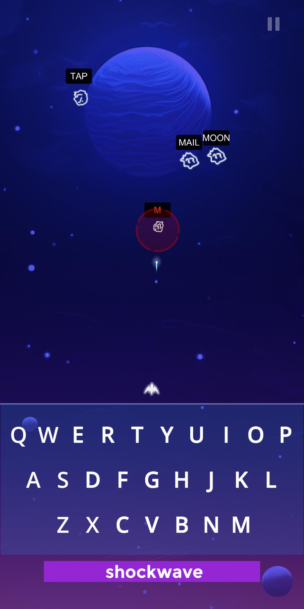
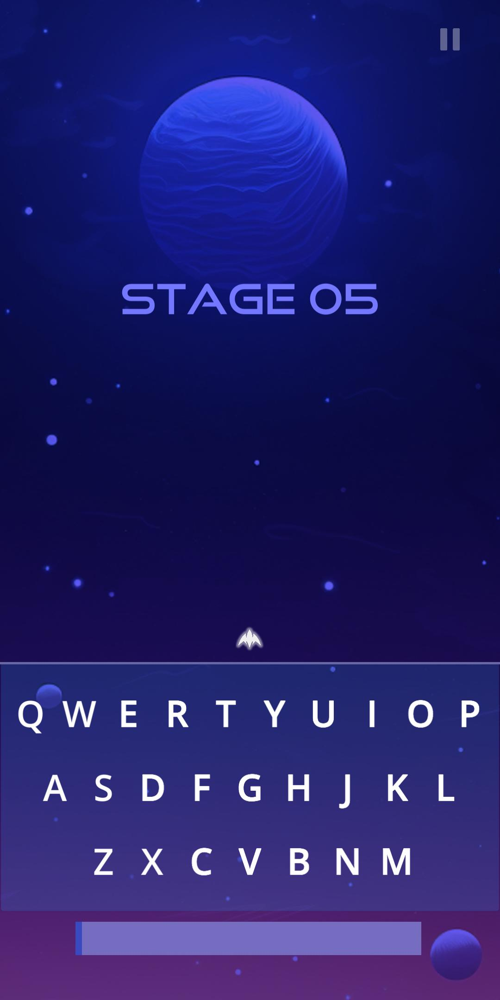
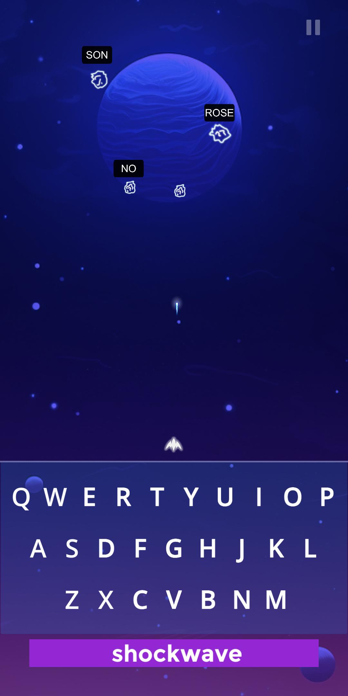
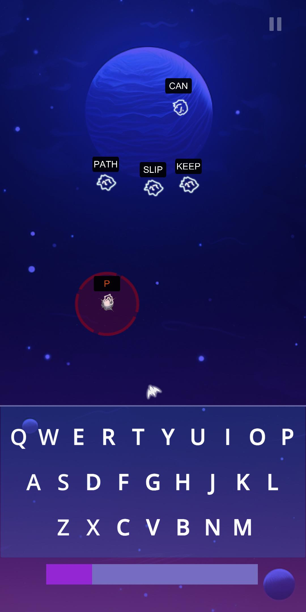
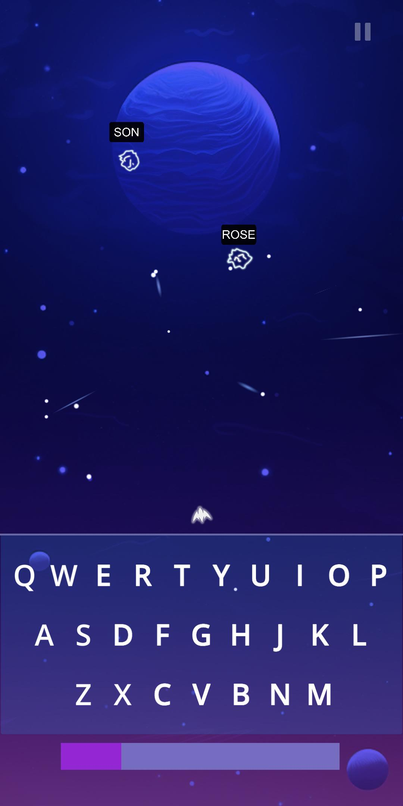
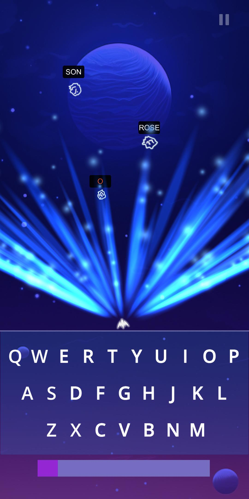

# Type-It

<b>Game Desctiption:</b>

Type It is 2D android game for mastering typing skills to next level. Goal is to type as fast possible words that apear on screen (represented as obstacles). When you type correct word, the ship will destroy that asteroid witch represented that word.
When you destroy all asteroids/obstacles, the new stage is comming on you with more complex words.

<b>Tehnologies used in this project:</b>

 - Unity game engine
 - C#
 - Adobe Photoshop

<b>Gameplay video:</b>
  - https://drive.google.com/file/d/1K2LUJiAfZcuF2UL3y4YOzrPc9Ozqr-X7/view?usp=sharing

<b>Gameplay images:</b>
  

